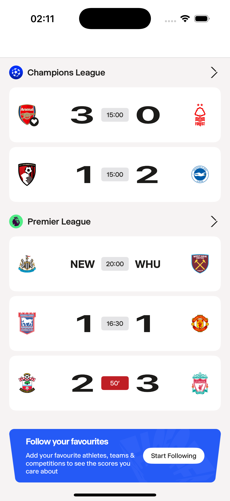
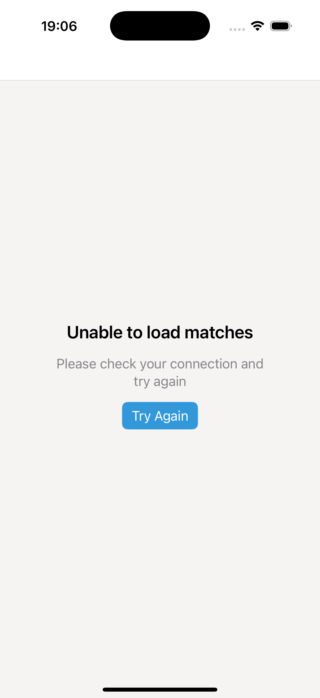
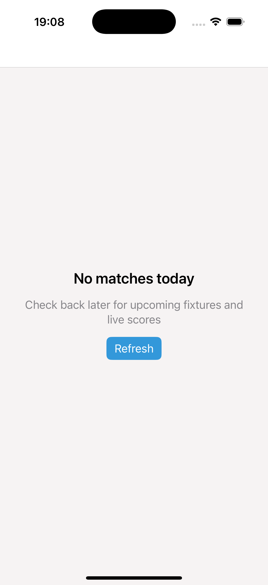
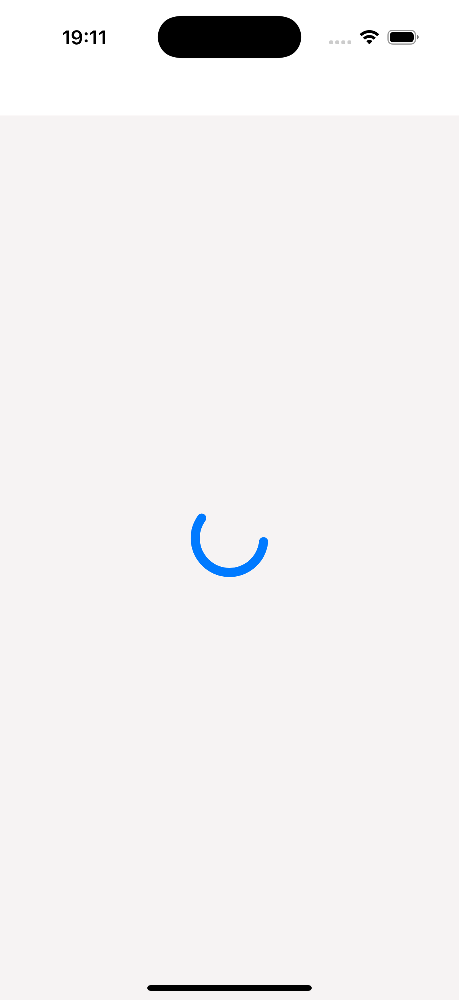
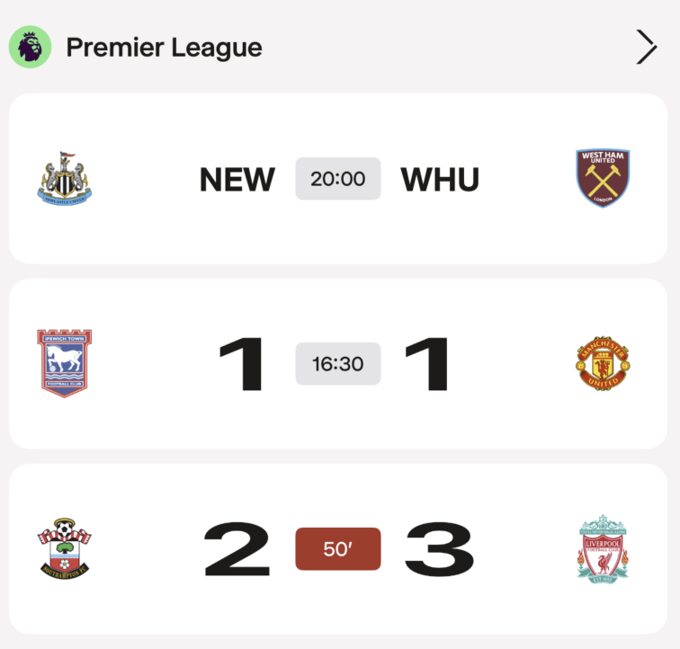
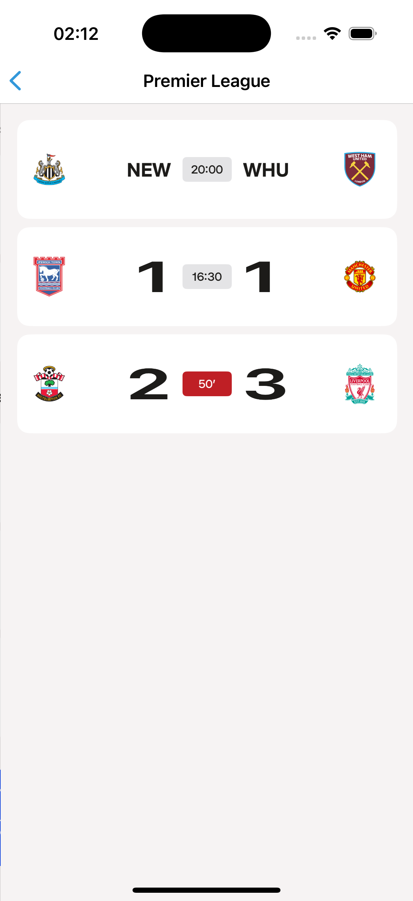
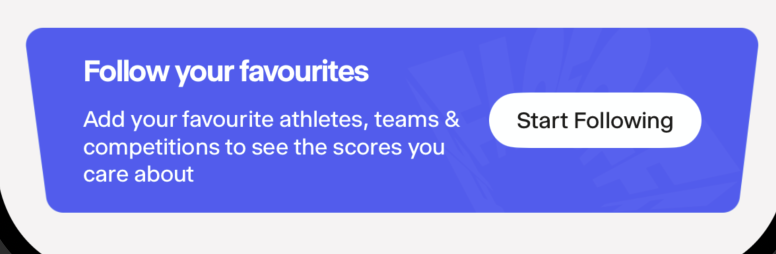
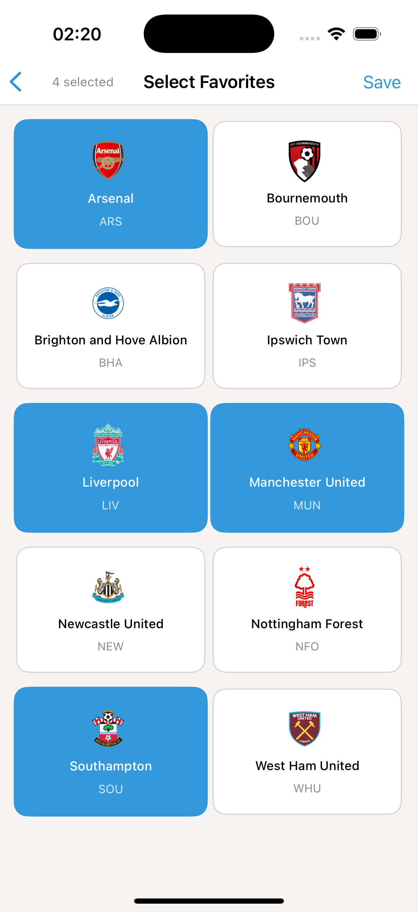
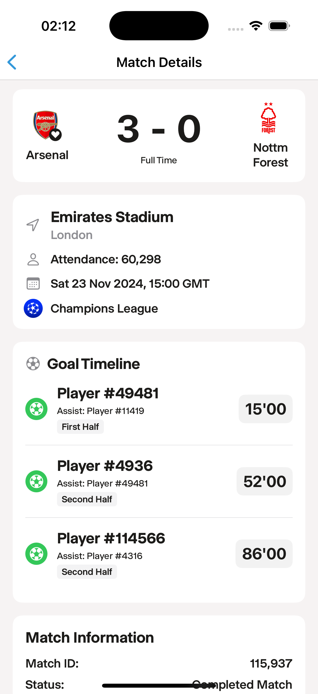
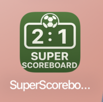

# SuperScoreboard - Technical Implementation Summary

iOS football scoreboard app built for Two Circles technical assessment. Features real-time match data, favorites management, and clean architecture with SwiftUI.

---

## 🏠 Home View States

 
<em>Loaded • Error • Empty • Loading</em>

- **Loaded State**: Real-time match data with competition grouping
- **Error State**: User-friendly error messages with retry functionality
- **Empty State**: Clear messaging when no matches available
- **Loading State**: Skeleton animations during data fetch

---

## ⚽ Match Components & Competition Views

 
<em>Competition Grouping • Competition Matches</em>

- **Match Cards**: Handle upcoming, live, and completed matches with heart badge icons for favorites
- **Competition Grouping**: Automatic grouping with expandable sections and smooth animations
- **Competition Matches**: Filtered view accessed by tapping headers, maintains all card functionality

---

## ❤️ Favorites System

 
<em>Favorites Card • Favorites Management Page</em>

- **Favorites Card**: Quick access component with heart animations and navigation to full list
- **Favorites Management**: Complete club selection with UserDefaults persistence and real-time updates
- **Cross-App Integration**: Heart badges update instantly across all views, survives app restarts

---

## 🔍 Match Detail Page

 
<em>Comprehensive match information and timeline</em>

- Comprehensive match information with goal timeline and timestamps
- Venue, attendance, and competition details
- Rich data presentation beyond basic match cards

---

## 🎨 App Icon

 
<em>Custom football-themed app icon design</em>

- Custom designed app icon
- Football-themed branding
- iOS standard icon sizes supported
