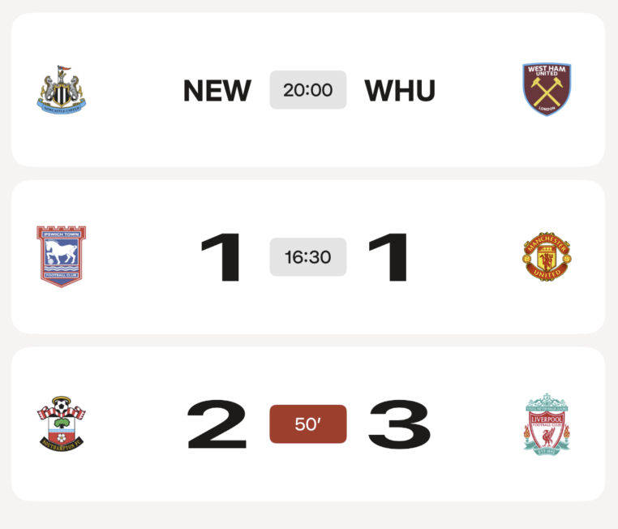

# SuperScoreboard - Technical Implementation Summary

iOS football scoreboard app built for Two Circles technical assessment. Features real-time match data, favorites management, and clean architecture with SwiftUI.

---

<table>
<tr>
<td width="50%">

### 🏠 Home View - Loaded State

<em>Main interface showing grouped matches by competition</em>

- Real-time match data from remote API
- Competition grouping and navigation
- Localized strings throughout interface

</td>
<td width="50%">

### 🔄 Home View - Loading State

<em>Loading indicators while fetching match data</em>

- Skeleton loading animations
- Smooth transition to loaded state
- User feedback during data fetch

</td>
</tr>
<tr>
<td width="50%">

### ⚠️ Home View - Error State

<em>Error handling with retry functionality</em>

- User-friendly error messages
- Retry button for failed requests
- Graceful fallback UI

</td>
<td width="50%">

### 📭 Home View - Empty State

<em>Empty state when no matches are available</em>

- Clear messaging for empty data
- Guidance for user next steps
- Consistent design language

</td>
</tr>
<tr>
<td width="50%">

### ⚽ Match Card Component

<em>Individual match cards with status indicators</em>

- Handles upcoming, live, and completed matches
- Heart badge icons show favorites on team badges
- Real-time status and favorite updates

</td>
</tr>
<tr>
<td width="50%">

### ❤️ Favorites Card Component

<em>Quick access to favorites management</em>

- Tap to navigate to full club list
- Heart animations for favorite state changes
- Persistent favorites with UserDefaults

</td>
<td width="50%">

### 🏆 Matches Grouped by Competition

<em>Expandable competition sections with match listings</em>

- Automatic competition grouping
- Tap headers to view competition-specific matches
- Expandable sections with smooth animations

</td>
</tr>
<tr>
<td width="50%">

### 🔍 Match Detail Page

<em>Comprehensive match information and timeline</em>

- Comprehensive match information
- Goal timeline with timestamps
- Venue, attendance, and competition details

</td>
<td width="50%">

### 🏆 Competition Matches Page

<em>Filtered view showing single competition matches</em>

- Competition-filtered match view
- Accessed by tapping competition headers
- Maintains all match card functionality

</td>
</tr>
<tr>
<td width="50%">

### ❤️ Favorites Management Page

<em>Complete club list for selecting favorites</em>

- Complete club list for favorite selection
- Persistent storage with UserDefaults
- Real-time heart updates across entire app
- Survives app restarts until deletion

</td>
<td width="50%">

### 🎨 App Icon

<em>Custom football-themed app icon design</em>

- Custom designed app icon
- Football-themed branding
- iOS standard icon sizes supported

</td>
</tr>
</table>

---

## 🛠️ Technical Implementation

**Architecture:**
- Clean architecture (Core/Domain/SuperScoreboard modules)
- SwiftUI + Swift 6 with @Observable
- Protocol-oriented design with dependency injection

**Quality:**
- Comprehensive unit tests with Swift Testing
- Full accessibility and localization support
- Production-ready error handling